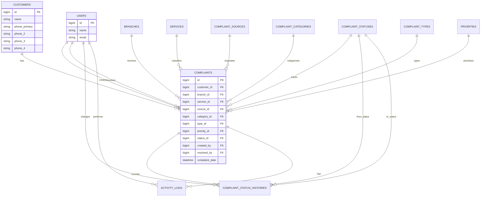

# Complaint Management System — Database Design

**Status:** Implemented baseline, with room for future modules  
**Database:** The verified local runtime is SQL Server at `127.0.0.1:1433`, database `complaints`; PHPUnit continues to use in-memory SQLite. Migrations remain portable between SQL Server, MySQL, and SQLite tests where practical.

## 1. Design Principles

The database separates customers, complaints, dynamic master data, authorization, status history, and audit activity. Complaint records keep foreign-key references to master data so reports remain consistent. Master data is deactivated with `is_active = false` when it should no longer be selectable for new complaints; soft deletes and restricted deletion protect historical records.

All timestamps use Laravel’s normal timestamp handling. Business dates are stored separately from record creation timestamps. JSON columns are used only for audit snapshots where structured old/new values are useful.

## 2. Tables Summary

| Table | Purpose | Soft deletes |
|---|---|:---:|
| users | Authenticated application users and complaint actors | No |
| customers | Customers with one required and up to three optional phones | Yes |
| branches | Dynamic branch master data | Yes |
| services | Dynamic service master data | Yes |
| complaint_sources | Dynamic complaint-origin master data | Yes |
| complaint_categories | Dynamic complaint-category master data | Yes |
| complaint_types | Dynamic complaint-type master data | Yes |
| priorities | Dynamic priority master data and colors | Yes |
| complaint_statuses | Dynamic complaint-status master data and colors | Yes |
| complaints | Customer complaints and resolution metadata | Yes |
| complaint_status_histories | Immutable status transitions and reasons | No |
| activity_logs | Append-oriented audit events and snapshots | No |
| visitors_visit_types | Quality inspection types | No |
| visitors_sections | Inspection checklist sections | No |
| visitors_root_causes | Non-compliance root causes | No |
| visitors_checklist_items | Checklist questions per inspection type | No |
| visitors_visits | Inspection visit header (branch/inspector/date/status) | No |
| visitors_visit_items | Snapshot of each checklist item for a visit | No |
| visitors_visit_photos | Private evidence photos for visit items | No |
| visitors_capa_actions | Corrective/preventive actions from non-compliances | No |
| visitors_capa_updates | CAPA history timeline entries | No |
| visitors_severities | Quality severity master (Critical/Major/Minor) | No |
| visitors_imports | Auditable Excel import headers and status | No |
| visitors_import_rows | Per-import-row raw data and validation errors | No |
| Spatie permission tables | Roles, permissions, and model assignments | No |
| cache/jobs tables | Existing Laravel infrastructure | Existing skeleton behavior |

## 3. Core Tables and Columns

### 3.1 `users`

The existing Laravel users table remains the authentication source. It must provide the normal `id`, `name`, `email`, `password`, verification, and timestamps. No manual `created_by` name is stored in complaints; complaints reference `users.id`.

Additional profile fields such as `locale` may be added only if the existing authentication design needs a per-user language preference. Otherwise, locale is stored in the session.

### 3.2 `customers`

| Column | Type | Constraints and reason |
|---|---|---|
| id | big integer | Primary key |
| name | string | Required customer name |
| phone_primary | string | Required; indexed; normalized before saving |
| phone_2 | string nullable | Optional; indexed |
| phone_3 | string nullable | Optional; indexed |
| phone_4 | string nullable | Optional; indexed |
| address | text nullable | Optional address |
| created_at | timestamp | Laravel timestamp |
| updated_at | timestamp | Laravel timestamp |
| deleted_at | timestamp nullable | Soft delete |

The four phone columns are deliberately explicit because the requirements define a maximum of four numbers and require a simple OR search. Phone values should be normalized consistently, for example by trimming whitespace and applying the application’s chosen digit representation. A unique constraint is not imposed across all phone columns in the first design because cross-column uniqueness is database-specific and duplicates may require a business decision. The application may reject an exact duplicate phone during customer creation after a clear policy decision.

Indexes: separate indexes on `phone_primary`, `phone_2`, `phone_3`, and `phone_4`; an index on `name` only if name search is used frequently.

### 3.3 Master-data tables

The following tables share a simple structure and are managed separately so Source and Category remain distinct concepts:

- `branches`
- `services`
- `complaint_sources`
- `complaint_categories`
- `complaint_types`
- `priorities`
- `complaint_statuses`

| Column | Type | Constraints and reason |
|---|---|---|
| id | big integer | Primary key |
| name | string | Required display name |
| color | string nullable or string | Hex/CSS-safe display color; required for priorities and statuses |
| is_active | boolean | Default true; controls new selections |
| sort_order | unsigned integer | Default 0; stable UI ordering |
| level | unsigned integer nullable | Used by priorities to order severity |
| code | string nullable | Used by branches for a stable business code |
| created_at | timestamp | Laravel timestamp |
| updated_at | timestamp | Laravel timestamp |
| deleted_at | timestamp nullable | Soft delete |

Column application by table:

| Table | `code` | `color` | `level` |
|---|:---:|:---:|:---:|
| branches | Yes | No | No |
| services | No | Yes | No |
| complaint_sources | No | Yes | No |
| complaint_categories | No | Yes | No |
| complaint_types | No | Yes | No |
| priorities | No | Yes, required | Yes, useful for severity ordering |
| complaint_statuses | No | Yes, required | No |

Instead of `code`/`level`, `complaint_types` additionally carries two nullable foreign keys: `category_id` referencing `complaint_categories` and `priority_id` referencing `priorities`, both `nullOnDelete`. They are required at the application level: the master-data type form requires them, and complaint create/edit validation rejects a type that lacks either. Every complaint type must therefore map to one category and one priority so the complaint category/priority can be derived from the selected type.

### 3.3.1 Derived category and priority

`complaints.category_id` and `complaints.priority_id` are read-only from the user's perspective. On complaint creation the controller derives both from the selected complaint type (`StoreComplaintRequest::type()`). On edit they are re-derived only when the selected type changes; otherwise the stored values are preserved so unrelated data is never overwritten. `StoreComplaintRequest`/`UpdateComplaintRequest` omit them from their rules and add a validation error on `type_id` when the type has no configured category/priority (`common.type_missing_category_priority`). The complaint form renders them as read-only badges (`#type-derived`), not as editable selects.

Branch `code` should be unique among non-deleted branches if it is used operationally. Names should have a practical uniqueness rule per table, normally unique among active/non-deleted records. The migration should avoid database-specific partial unique indexes unless required; validation and a conventional unique field can be used where appropriate.

### 3.4 `complaints`

| Column | Type | Constraints and reason |
|---|---|---|
| id | big integer | Primary key |
| customer_id | foreign big integer | Required; references customers |
| branch_id | foreign big integer | Required; references branches |
| service_id | foreign big integer | Required; references services |
| source_id | foreign big integer | Required; references complaint_sources |
| category_id | foreign big integer | Required; references complaint_categories (derived from the selected complaint type — not client-editable) |
| type_id | foreign big integer | Required; references complaint_types |
| priority_id | foreign big integer | Required; references priorities (derived from the selected complaint type — not client-editable) |
| status_id | foreign big integer | Required; references complaint_statuses |
| short_description | string | Required summary |
| description | text | Required full complaint |
| complaint_date | date/datetime | Required business submission/occurrence date; indexed |
| serial_number | string (255) nullable | Optional product/device serial number (since 2026-09-06) |
| price | decimal (12,2) nullable | Optional purchase price (since 2026-09-06) |
| created_by | foreign big integer | Required; references users |
| resolved_by | foreign big integer nullable | Resolver user; populated when solved |
| resolved_at | timestamp nullable | Resolution timestamp |
| resolution | text nullable | How the complaint was solved |
| created_at | timestamp | Laravel timestamp |
| updated_at | timestamp | Laravel timestamp |
| deleted_at | timestamp nullable | Soft delete |

Foreign-key behavior must preserve history. The preferred behavior is `no action` for referenced master data and users, or a nullable foreign key only where the business explicitly accepts losing the actor reference. Laravel migrations use `noActionOnDelete()` because SQL Server does not accept `ON DELETE RESTRICT`; this has the same restrictive/no-action business semantics. The application should soft-delete or deactivate referenced records instead of physically deleting them. Customer deletion should be prevented or restricted when complaints exist; if a later policy allows it, the customer foreign key must remain safe and historical display must be designed first. No blanket cascade delete is used.

Indexes: indexes on each foreign key used by filters and joins; an index on `complaint_date`; composite indexes may be added after observing report query patterns, especially `(branch_id, complaint_date)` and `(status_id, complaint_date)` if they materially improve reports.

### 3.5 `complaint_status_histories`

| Column | Type | Constraints and reason |
|---|---|---|
| id | big integer | Primary key |
| complaint_id | foreign big integer | Required; references complaints |
| from_status_id | foreign big integer nullable | Null for the first recorded transition if needed |
| to_status_id | foreign big integer | Required new status |
| reason | text nullable | User explanation for the change |
| changed_by | foreign big integer | Required authenticated actor |
| changed_at | timestamp | Required event timestamp |
| created_at | timestamp | Laravel timestamp |
| updated_at | timestamp | Laravel timestamp |

Indexes: `complaint_id`, `changed_at`, `to_status_id`, and `changed_by`. Status-history rows are append-only in the application and are not soft-deleted, because the requirement says history must not be lost. Foreign keys use explicit no-action behavior in the migrations for SQL Server portability.

### 3.6 `activity_logs`

| Column | Type | Constraints and reason |
|---|---|---|
| id | big integer | Primary key |
| user_id | foreign big integer nullable | Actor; nullable for system actions |
| action | string | Stable action name such as `complaint.updated` |
| subject_type | string nullable | Polymorphic model type |
| subject_id | big integer nullable | Polymorphic model id |
| description | text nullable | Human-readable event description |
| old_values | json nullable | Previous values for important changes |
| new_values | json nullable | New values for important changes |
| created_at | timestamp | Event timestamp |

Indexes: `(subject_type, subject_id)`, `user_id`, `action`, and `created_at`. Logs are append-oriented, restricted by `audit.view`, and not exposed for normal editing or deletion. A polymorphic subject keeps audit logging simple without one nullable foreign key for every audited model.

## 4. Authorization Tables

Spatie Laravel Permission 6.24.0 adds its standard tables, normally `permissions`, `roles`, `model_has_permissions`, `model_has_roles`, and `role_has_permissions`. The published package migration is the source of truth for their exact columns and indexes. The application seeds permissions such as `customer.view`, `complaint.create`, `complaint.view_logs`, `report.export`, `user.update`, and `role.update` systematically.

The Super Admin role is seeded with all permissions. Authorization code checks the protected role before allowing role/user changes, so removing buttons is not the only safeguard. Normal Admin users cannot remove Super Admin’s role or permissions through the UI or a crafted request.

## 5. Relationship Map

## 6. Foreign Keys and Delete Policy

| Reference | Preferred behavior | Reason |
|---|---|---|
| complaints.customer_id | Restrict/no action | Complaints must retain customer context |
| complaints.branch_id and other master-data ids | Restrict/no action | Historical reports must remain valid |
| complaints.created_by | Restrict/no action or carefully nullable | Preserve actor identity |
| complaints.resolved_by | Set null only if user deletion is allowed | Resolution remains readable even if account is retired |
| complaint_status_histories.complaint_id | Restrict/no action | History must not disappear with a complaint |
| activity_logs.user_id | Set null for system/account retirement | Audit event can remain when actor account is unavailable |
| activity_logs subject | No database FK because it is polymorphic | Log must not prevent normal model lifecycle |

Soft deletes and deactivation are preferred over physical deletion. Any future purge process must explicitly account for audit and statutory retention requirements.

## 7. Validation and Integrity Rules

Customer `name` and `phone_primary` are required. `phone_2`, `phone_3`, and `phone_4` are nullable. Complaint foreign keys are required and validated with `exists` rules against the appropriate tables. New complaints accept active master-data records only; existing complaints may continue to reference inactive records. The creator is always taken from the authenticated user and never from a submitted form field.

When a complaint is moved into the configured Solved status, the application stores `resolved_by` and `resolved_at` from the authenticated user and current time. The UI asks for a resolution and displays it on the complaint timeline. Status changes are performed inside a transaction and require a history row.

## 8. Query and Reporting Index Plan

The first migration set should add indexes to all complaint filter foreign keys, `complaint_date`, creator, resolver, and each customer phone column. This directly supports the main workflow and filter/report queries. The application should use `with()` for customer, branch, master-data, creator, resolver, and status-history display to prevent N+1 queries.

The complaint listing uses `paginate()` and preserves query strings. The branch report groups by `complaint_date` and `branch_id` in SQL. Excel export uses the filtered query with chunking rather than constructing a large in-memory collection. Additional composite indexes should be added only after profiling actual query plans.

## 9. Migration Order

1. Keep the existing Laravel users/cache/jobs migrations.
2. Add Spatie Permission’s published migration.
3. Create customers and all master-data tables.
4. Create complaints after every referenced table exists.
5. Create complaint status histories after complaints and statuses exist.
6. Create activity logs after users and auditable models exist.
7. Seed permissions, roles, master data, users, customers, and demo complaints.

The implemented migration order follows this plan. Seeders now provide the four baseline roles, systematic permissions, an initial Super Admin account, master-data examples, and realistic demo customers/complaints. Each future schema change must update this document and `project_structure.md` before the change is considered complete.

## 10. Test Coverage Required by the Design

Feature tests must cover required and optional phone validation, search through each of the four phone columns, complaint creation with authenticated `created_by`, all required relationships, status-history creation, resolution metadata, Super Admin protection, permission denial, customer/date/status/priority filters, multiple-branch filtering, combined filters, filtered export, and English/Arabic export headings.

## 11. Dashboard Analytics Data Definitions

The authenticated dashboard reuses the complaint data model through `DashboardFilterRequest` and `DashboardStatsService`; it introduces no new table or column. All KPI, chart, ranking, recent-list, and insight results are calculated from the current filter set using Eloquent queries and SQL aggregation.

| Metric | Definition |
|---|---|
| Total complaints | Count of complaints matching the selected date, branch, service, source, category, type, priority, and status filters. Date filtering uses `complaint_date`. |
| Resolved complaints | Complaints whose current status is named `Solved` or `Closed`, matched case-insensitively against the status master data. |
| Resolution rate | Resolved complaints divided by total filtered complaints multiplied by 100; zero when no filtered complaints exist. |
| High + Critical | Complaints whose priority master-data name is `High` or `Critical`. |
| Trend | Complaints grouped from `complaint_date`; periods of up to 31 days use daily buckets, up to 180 days use week-start buckets, and longer periods use month buckets. |
| Average resolution time | Average non-negative duration from Laravel `created_at` to nullable `resolved_at`, calculated only for filtered complaints where both timestamps exist. It is omitted when no reliable interval exists. |
| Branch performance | SQL grouping by `branch_id`, with total, percentage of filtered total, resolved, pending, high/critical, and resolution-rate values. |
| Previous-period comparison | The same non-date filters applied to an immediately preceding period of equal length. |

The dashboard reads existing foreign-key relationships to branches, services, sources, categories, types, priorities, and statuses. Master-data names remain database values rather than per-locale fields; interface labels and metric definitions are translated through Laravel dictionaries. No dashboard-specific schema migration or index was required after reviewing the existing `complaint_date`, branch/date, status/date, `created_at`, and `resolved_at` support.

## 6. Quality Visits (Inspection) Schema (2026-08-31)

A separate `visitors_`-prefixed set of tables models quality inspections. They are independent of the complaint schema and deliberately omit soft deletes. Because SQL Server forbids multiple cascade paths, derived foreign keys use `noActionOnDelete()` rather than cascading.

### Master data
| Table | Columns | Notes |
|---|---|---|
| `visitors_visit_types` | id, name, code, is_active | Inspection type (daily, monthly, occupational_safety) |
| `visitors_sections` | id, name, code, sort_order, is_active | Checklist grouping |
| `visitors_root_causes` | id, name, code, is_active | Non-compliance root causes |
| `visitors_checklist_items` | id, visit_type_id (FK), section_id (FK), code, title, severity, deduction_score, photo_required, immediate_action, corrective_action, preventive_action, responsible, period_hours, sort_order, is_active, root_cause_id (FK nullable) | Questionnaire; `photo_required` set when severity = critical; `root_cause_id` is the suggested/default root cause added by the Excel master-import migration (inspector still chooses freely at NC time) |
| `visitors_severities` | id, name, code, sort_order, is_active | Severity master seeded Critical/Major/Minor; deduction is configured per item and never derived from the severity name |

### Transactions
| Table | Columns | Notes |
|---|---|---|
| `visitors_visits` | id, visit_type_id, branch_id, inspector_id, visit_date, status, started_at, completed_at | status = in_progress/completed; indexed on inspector/status and branch/date |
| `visitors_visit_items` | id, visit_id (FK cascade), checklist_item_id (FK), status, visited_at, root_cause_id, note, main_kitchen, support_department, and snapshot columns (item_code, item_title, section_name, severity, deduction_score, photo_required, immediate/corrective/preventive_action, responsible, period_hours) | unique(visit_id, checklist_item_id); snapshot is immutable at creation |
| `visitors_visit_photos` | id, visit_id (FK cascade), visit_item_id (FK noAction), path, original_name, mime_type, original_size, compressed_size | Stored privately on the `local` disk; served via authenticated route |
| `visitors_capa_actions` | id, visit_id (FK cascade), visit_item_id (FK noAction), title, immediate/corrective/preventive_action, responsible_user_id (FK noAction), period_hours, due_at, status, completed_at, reviewed_at, reviewed_by (FK noAction) | stored status = open/in_progress/closed/rejected only; overdue/completed/closed_late/immediate/upcoming/due_soon are virtual via `App\Services\Visitors\DueDateService::dueStatus()`; due_at = created_at + period_hours, computed once at creation (NULL when period_hours is 0/null -> Immediate = no due date); `period_hours` is decimal 8,2 nullable; legacy `due_date` column still exists but is unused; due_soon window uses `visitors.due_soon_hours` (default 24, env VISITORS_DUE_SOON_HOURS) |
| `visitors_capa_updates` | id, capa_action_id (FK cascade), user_id, status, comment, photo, created_at | Append-only CAPA timeline |

### Master data imports (Excel)
| Table | Columns | Notes |
|---|---|---|
| `visitors_imports` | id, user_id (FK noAction), file_name, file_size, extension, status, total_rows, valid_rows, invalid_rows, created_records, updated_records, failed_records, error_message, completed_at, timestamps | Auditable Excel import header; status = pending/validating/ready/imported/failed/cancelled; imported master data is never physically deleted (create/update only) |
| `visitors_import_rows` | id, import_id (FK cascade), row_number, code, inspection_type, valid, errors, data, created, updated, timestamps | Per-row raw normalized data + validation errors; the import up-sert is keyed on the inspection-type code plus the item's `code` column (Excel `note` text is copied to `visitors_checklist_items.title`) |

Key decisions: progress is derived from `visited_at` being non-null (items are created with `visited_at` null and `status = pending` so nothing is chosen/Compliant by default; an item is reviewed only when the inspector picks a status, which also stamps `visited_at`); the checklist configuration is copied onto each `visitors_visit_items` row at visit creation so historical inspections remain stable even if the checklist changes later; the score is shown only on reports (it is hidden on the inspection page so the visit creator does not see a branch score while filling it out); score is computed only on the backend from the snapshot `deduction_score` values; master-data imports never overwrite those `visitors_visit_items` snapshots and never delete rows (create/update up-sert only), with the whole file rejected when any row fails validation.
