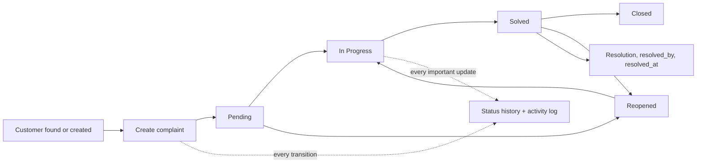
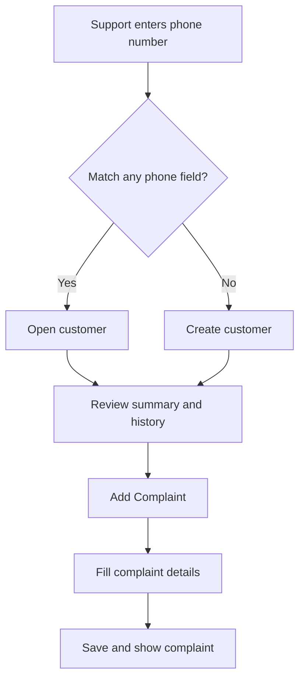

# Complaint Management System — Project Structure and Architecture

**Status:** Implemented baseline, with room for future modules  
**Application:** Complaint Management System  
**Framework:** Laravel 12, PHP 8.2+, Blade, Tailwind CSS, Eloquent ORM  
**Primary languages:** English and Arabic, including RTL support  

## 1. Project Overview

The application is a normal Laravel web application for customer-support teams. Authenticated staff search for customers by any of up to four phone numbers, create or update customers, and register complaints. Complaints are connected to dynamic master data such as branches, services, sources, categories, types, priorities, and statuses. Staff can follow the complaint lifecycle, record resolutions, and review a durable status history and activity timeline.

The design intentionally uses Laravel-native controllers, form requests, policies, Eloquent relationships, Blade views, small query scopes, and focused services only where they prevent duplication. It does not introduce a repository layer, a generic CRUD framework, a separate frontend application, or microservices.

## 2. Technology Stack

| Concern | Decision |
|---|---|
| Backend | Laravel 12 on PHP 8.2+ |
| Rendering | Blade templates with Blade components |
| Styling | Tailwind CSS, using the existing Vite build |
| Database | The relational database configured by the project; SQLite remains useful for automated tests |
| ORM | Laravel Eloquent |
| Authentication | Laravel authentication using the project’s selected starter approach |
| Authorization | Laravel Policies/Gates plus Spatie Laravel Permission 6.24.0 |
| Excel | `maatwebsite/excel` 3.1.67 with query-based exports |
| Tests | Laravel feature/unit tests with the existing PHPUnit setup |
| Localization | Laravel `en` and `ar` translation files, with direction switching in the main layout |

React, Vue, Inertia, and a separate SPA are deliberately excluded. Livewire may be added only for small interactive areas such as phone search, dependent filtering, or modal forms if ordinary Blade forms become awkward.

## 3. Architecture Overview

The request flow is:

1. The browser sends a request to a named Laravel route.
2. Authentication middleware confirms the user is signed in.
3. A policy or permission middleware checks the requested ability.
4. A form request validates and authorizes submitted data.
5. A controller uses Eloquent queries and relationships to read or write data.
6. Important mutations call a small activity-log service and, for status changes, create a status-history row in the same database transaction.
7. The controller redirects with a translated flash message or renders a Blade view.

The complaint create and update operations use a database transaction so the complaint mutation, status history, resolution metadata, and corresponding activity entry do not become inconsistent. Listing pages use eager loading, pagination, and composable Eloquent scopes. Reports use grouped database queries rather than loading every complaint into memory.

### Authorization flow

Authorization is enforced on the server, not only by hiding navigation items. Routes use authentication and permission checks, controllers use policies where a record is involved, and form requests authorize the operation. Super Admin is recognized as a protected role with an application-level bypass for all permissions. Normal administrators cannot edit or remove the Super Admin role, its permissions, or the final Super Admin account through ordinary user-management screens.

## 4. Main Modules

| Module | Responsibility |
|---|---|
| Dashboard | Seven-day complaint counts, branch ranking, status distribution, and priority distribution |
| Customers | Search by name or any phone, create/edit customer, summary counts, complaint history |
| Complaints | Create, list, filter, view, update, assign, resolve, status history, and timeline |
| Branches | Manage active/inactive branches without breaking historical complaints |
| Services | Manage complaint service master data and display colors |
| Sources | Manage complaint source master data separately from categories |
| Categories | Manage complaint categories separately from sources |
| Complaint Types | Manage detailed complaint types |
| Priorities | Manage priority names, levels, colors, and ordering |
| Statuses | Manage complaint statuses, colors, and ordering |
| Reports | Branch-by-day complaint report with date and multi-branch filters |
| Excel Export | Export the current complaint query and headings in the active language |
| Users | Manage ordinary users and their roles, subject to authorization rules |
| Roles and Permissions | Configure granular permissions, while protecting Super Admin access |
| Audit Logs | Restricted activity log with old/new JSON snapshots and a complaint timeline |
| Localization | English/Arabic translations, locale switch, and LTR/RTL layout direction |

## 5. Principal Relationships

A customer has many complaints, while each complaint belongs to exactly one customer and branch. A complaint also belongs to one service, source, category, type, priority, and status. A complaint is created by one user and may be resolved by another user. A complaint has many status-history rows and activity-log entries.

Master-data records remain queryable through historical relationships after deactivation. Soft deletion is used where appropriate, and destructive deletion is restricted when a record is referenced by a complaint. Historical rows therefore remain understandable instead of losing their labels or foreign-key integrity.

## 6. Complaint Lifecycle

A complaint starts with a selected active status, normally **Pending**. Authorized users may update its master-data assignments and details. Every status change records the previous status, new status, reason, user, and timestamp in `complaint_status_histories`. When the new status is the configured Solved status, the application records the authenticated resolver and timestamp; the form prompts for a resolution. If a solved complaint is reopened, the earlier resolution metadata is retained for historical context and the new status transition is recorded.

There is no hard-coded finite-state machine because statuses are dynamic master data. The application does, however, validate that selected statuses exist and are active for new selections; historical inactive statuses remain valid on existing complaints.



## 7. Customer Workflow



The search query checks `phone_primary`, `phone_2`, `phone_3`, and `phone_4` with an OR condition. The primary phone is required; the other three are nullable. The customer page displays contact information, complaint totals by status, an obvious **Add Complaint** action, and paginated complaint history.

## 8. Filtering and Reporting Design

The complaints listing accepts customer, branch, service, source, category, type, priority, status, created-by, date-from, and date-to filters. Branches are submitted as an array and applied with `whereIn`, so selecting multiple branches returns complaints from any selected branch. The same validated filter input is used by the HTML listing and the Excel export route, preventing export from silently ignoring active filters.

Filter logic should live in readable Eloquent scopes on `Complaint` or in one small `ComplaintFilter` class if the controller would otherwise become repetitive. Query parameters are named and preserved in pagination links. The page displays the filtered result count before the table and uses paginated results rather than loading all records.

The branch report groups complaints by complaint date and branch after applying the date range and multi-branch filters. Dashboard cards use aggregate queries for the last seven days, status counts, priority counts, and the most complained-about branches. Lightweight CSS or a small chart library may be used only where it improves comprehension.

## 9. Excel Export Design

The export is implemented with a query-based Laravel Excel export. It receives the validated complaint filters and builds the same filtered Eloquent query used by the listing. It selects useful fields through relationships and uses chunked/query-based processing for scalability. The export headings are translated according to the current locale; there is one export class with a localization map rather than separate Arabic and English export classes.

The English export includes Complaint ID, customer identity and phones, address, branch, service, source, category, complaint type, descriptions, priority, status, complaint date, creator, resolver, resolution, and timestamps. The Arabic export uses equivalent translated headings. The export action is permission-protected.

## 10. Localization and RTL Design

All user-facing labels, buttons, validation messages, status text, and export headings use Laravel translation keys. Translation files live under `lang/en` and `lang/ar`. The selected locale is stored in the authenticated user profile or session, and a small locale middleware applies it to each request. The main Blade layout sets `dir="rtl"` and an Arabic language attribute when the locale is Arabic; English uses `dir="ltr"`.

Database master-data names are initially single-language values because the requirements do not define translated columns. The structure remains open for future `*_translations` tables if localized master-data labels become necessary. The design does not silently duplicate master-data records for each language.

## 11. Roles and Permissions

The four baseline roles are **Super Admin**, **Admin**, **Customer Support**, and **Viewer**. Permissions use consistent dot notation. The Super Admin bypass is enforced in the authorization layer and is protected from removal by normal Admin users.

| Permission | Super Admin | Admin | Customer Support | Viewer |
|---|:---:|:---:|:---:|:---:|
| customer.view | Yes | Yes | Yes | Yes |
| customer.create | Yes | Yes | Yes | No |
| customer.update | Yes | Yes | Yes | No |
| customer.delete | Yes | Yes | No | No |
| complaint.view | Yes | Yes | Yes | Yes |
| complaint.create | Yes | Yes | Yes | No |
| complaint.update | Yes | Yes | Yes | No |
| complaint.delete | Yes | Yes | No | No |
| complaint.view_logs | Yes | Configurable | No by default | No |
| complaint.export | Yes | Yes | Configurable | Configurable |
| branch.view | Yes | Yes | No by default | Yes |
| branch.create/update/delete | Yes | Yes | No | No |
| service/source/category/type/priority/status.view | Yes | Yes | No by default | Yes |
| service/source/category/type/priority/status.manage | Yes | Yes | No | No |
| report.view | Yes | Yes | Configurable | Yes |
| report.export | Yes | Yes | Configurable | Configurable |
| user.view/create/update/delete | Yes | Configurable, excluding protected Super Admin operations | No | No |
| role.view/create/update/delete | Yes | Configurable, excluding protected Super Admin operations | No | No |
| audit.view | Yes | Configurable | No | No |

The seeders create all permission records systematically and assign the baseline roles. The exact Admin configuration is documented in seed data and may be adjusted by Super Admin.

## 12. Project Folder Structure

```text
app/
├── Exports/
│   └── ComplaintsExport.php
├── Http/
│   ├── Controllers/
│   │   ├── AuditLogController.php
│   │   ├── BranchController.php
│   │   ├── ComplaintController.php
│   │   ├── ComplaintStatusHistoryController.php
│   │   ├── CustomerController.php
│   │   ├── DashboardController.php
│   │   ├── MasterData controllers...
│   │   ├── ReportController.php
│   │   ├── RoleController.php
│   │   └── UserController.php
│   ├── Middleware/
│   │   └── SetLocale.php
│   └── Requests/
│       ├── ComplaintFilterRequest.php
│       ├── StoreComplaintRequest.php
│       ├── StoreCustomerRequest.php
│       ├── UpdateComplaintRequest.php
│       └── UpdateCustomerRequest.php
├── Models/
│   ├── ActivityLog.php
│   ├── Branch.php
│   ├── Complaint.php
│   ├── ComplaintCategory.php
│   ├── ComplaintSource.php
│   ├── ComplaintStatus.php
│   ├── ComplaintStatusHistory.php
│   ├── ComplaintType.php
│   ├── Customer.php
│   ├── Priority.php
│   ├── Service.php
│   └── User.php
├── Policies/
│   ├── ComplaintPolicy.php
│   ├── CustomerPolicy.php
│   └── ...
└── Services/
    ├── ActivityLogService.php
    └── ComplaintStatusService.php

database/
├── factories/
├── migrations/
└── seeders/
    ├── DatabaseSeeder.php
    ├── MasterDataSeeder.php
    ├── PermissionSeeder.php
    └── DemoDataSeeder.php

lang/
├── ar/
│   ├── complaints.php
│   ├── customers.php
│   ├── exports.php
│   └── validation.php
└── en/
    ├── complaints.php
    ├── customers.php
    ├── exports.php
    └── validation.php

resources/
├── css/app.css
├── js/app.js
└── views/
    ├── layouts/app.blade.php
    ├── components/
    ├── dashboard/index.blade.php
    ├── customers/{index,create,edit,show}.blade.php
    ├── complaints/{index,create,edit,show}.blade.php
    ├── master-data/{branches,services,sources,categories,types,priorities,statuses}/...
    ├── reports/branches.blade.php
    ├── users/...
    ├── roles/...
    └── audit-logs/index.blade.php

routes/
├── console.php
└── web.php

tests/
├── Feature/
│   ├── CustomerManagementTest.php
│   ├── ComplaintManagementTest.php
│   ├── ComplaintFiltersTest.php
│   ├── ComplaintExportTest.php
│   └── AuthorizationTest.php
└── Unit/
```

The existing Laravel skeleton files remain in place. The current implementation includes authenticated login/logout, dashboard, customer CRUD and phone search, complaint CRUD and filtering, status history, activity logging, master-data CRUD, localized Excel export, branch reports, user/role administration, Arabic/English layout switching, and baseline feature tests. New files are added only for the complaint system, authentication integration, localization, and authorization that the application actually uses.

## 13. Data and Audit Rules

All complaint foreign keys are validated server-side. Eloquent models use `$fillable` or guarded attributes deliberately. Master data uses `is_active` to control selection in new complaints, while old complaints continue to display inactive values. Soft deletes are used on business records where recovery and historical safety matter. Audit records are append-oriented; ordinary users cannot edit or delete them.

Every important complaint mutation records the user, action, subject, description, and old/new JSON values. Status changes additionally create a dedicated status-history entry. The complaint details page merges creation/update activity and status history into a chronological timeline, ordered by timestamp.

## 14. Implementation Roadmap

The implementation is intentionally incremental:

1. Finalize this design and the database design document.
2. Add Spatie Permission and Laravel Excel dependencies and publish only the needed migrations/configuration.
3. Create migrations with foreign keys, indexes, soft deletes, and seed data.
4. Add models, relationships, casts, scopes, factories, and baseline permissions.
5. Add authentication integration and protected authorization rules, including Super Admin protection.
6. Build the customer search, customer CRUD, summary, and complaint-history screens.
7. Build complaint creation, listing, filtering, editing, resolution, and detail timeline.
8. Add status history and activity logging in transactions.
9. Add dashboard aggregates and branch reports.
10. Add filtered, localized Excel export.
11. Add Arabic/English translations, locale switching, and RTL layout behavior.
12. Add feature tests for phone search, complaint ownership, status history, permissions, filters, and exports.
13. Run migrations, seed demo data, execute the test suite, build frontend assets, and clean up documentation.

## 15. Assumptions to Revisit

The requirements do not specify a registration flow, password-reset provider, attachment handling, branch-specific user scoping, or translated master-data names. The first implementation will use authenticated users managed by authorized administrators, will not implement attachments, will not restrict users to one branch unless later requested, and will keep master-data names in the active application language. These choices avoid inventing business rules while preserving extension points for future work.

## 16. Future Improvements Not Included Now

Attachments, internal comments, notifications, email or WhatsApp integration, satisfaction ratings, SLA tracking, escalation workflows, advanced analytics, branch-manager dashboards, customer portals, and mobile/API clients remain explicitly out of scope until requested.


### Administration refinements

The **Roles and Permissions** module supports custom-role creation and guarded deletion. Role creation is permission-protected and rejects the four reserved baseline role names. Baseline roles are never deletable, and a custom role cannot be deleted while any user is assigned to it; both rules are enforced in the controller in addition to conditional UI actions. New roles are created with the `web` guard and can then be configured through the existing permission editor.

The **Users** module lists users with eager-loaded roles and provides GET filters for name/email text and exact role selection. Results are database-filtered, ordered by name, paginated at 20 records, and preserve active filter parameters in pagination links, avoiding an in-memory load of the full user table.


### Localization completion

Localization now covers complaint and customer flash/activity messages, authentication failures, validation rules and field names, activity-log action labels, login branding/demo guidance, master-data headings, and customer complaint-summary statuses in both English and Arabic. Audit and complaint-timeline views translate known persisted action identifiers and use a localized generic fallback for unknown activity types, preventing raw keys such as `complaints.updated` from appearing in the interface.
